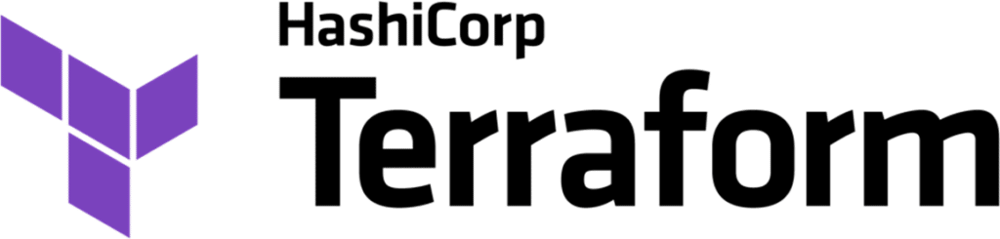

# __Links and Resources__:

- Codebase for this demo is here: [https://github.com/nmatare/llm-serve](https://github.com/nmatare/llm-serve)

- Access the Google Cloud project here: [GCP](https://console.cloud.google.com/home/dashboard?folder=&organizationId=&project=llm-serve-423918)

# 1. __Build on Google Cloud Platform__

#### - Create an isolated project on GCP (i.e., similar code for AWS, Azure, IBM, Oracle, etc)

#### - Provision a networked cluster within a private VPC (i.e., can support complex networking)

#### - Upload secrets with Google's secret manager (e.g., HuggingFace credentials)

<pre><code class="bash">// Login into created cluster
export \
	GITHUB_REPO_URL=https://github.com/nmatare \
	GITHUB_REPO_ORGANIZATION=llm-serve \
	CLUSTER_CLOUD=gcp \
	CLUSTER_NAME=llm-serve \
	CLUSTER_REGION=us-central1 \
	RAY_OPERATOR_STACK_VERSION=1.1.0

gcloud config set project llm-serve-112
gcloud auth application-default login

gcloud container clusters get-credentials testing-serving-gcp-us-central1 --zone us-central1
</code></pre>

# 2. __Provision Infra w/ Terraform__

#### - Today, we're going to leverage Terraform (but could be Ansible, Puppet, etc)

<pre><code class="language-go">// Hosts provider models on shared cluster
module "foundational_model_google-gemma" {
  source = "./serving"
  count  = 1
  settings = {
    # ref: https://github.com/ray-project/ray-llm
    model_name        = "google/gemma-2b"
    model_import_file = "model"
    model_import_path = "model:entrypoint"
    model_import_file:app_name
  }
}
</code></pre>

# 3. __Setup the Ray Operator__

#### - Ray Operator is abstraction over Ray primitives (e.g., runtime, actors, tasks, plasma store etc)

#### - Tightly coupled with Ray Serve, Ray LLM (formerly Aviary)

<pre><code class="bash">// Uses the Ray Operator setup cluster/services/serving
k get raycluster -n ray
k describe raycluster -n ray

k describe rayservice google-recurrentgemma-2b-it-model-server -n ray
k exec -it $HEAD_POD -n ray -- ls -lah /tmp/ray/session_latest/logs/serve
</code></pre>

# 4. __Get Model Weights From HuggingFace__

<pre><code class="python"># Use a pipeline as a high-level helper
from transformers import pipeline

pipe = pipeline("text-generation", model="google/gemma-7b")

from transformers import AutoTokenizer, AutoModelForCausalLM

tokenizer = AutoTokenizer.from_pretrained("google/gemma-7b")
model = AutoModelForCausalLM.from_pretrained("google/gemma-7b")
</code></pre>

# 5. __Perform Inference__

<pre><code class="language-go">// Hosts provider models on shared cluster
module "foundational_model_google-gemma" {
  source = "./serving"
  count  = 1
  settings = {
    # ref: https://github.com/ray-project/ray-llm
    model_name        = "google/gemma-2b"
    model_import_file = "model"
    model_import_path = "model:entrypoint"
    model_import_file:app_name
  }
}
</code></pre>

